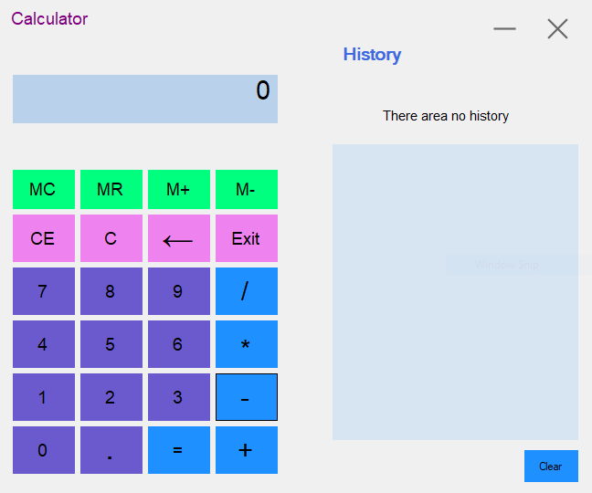
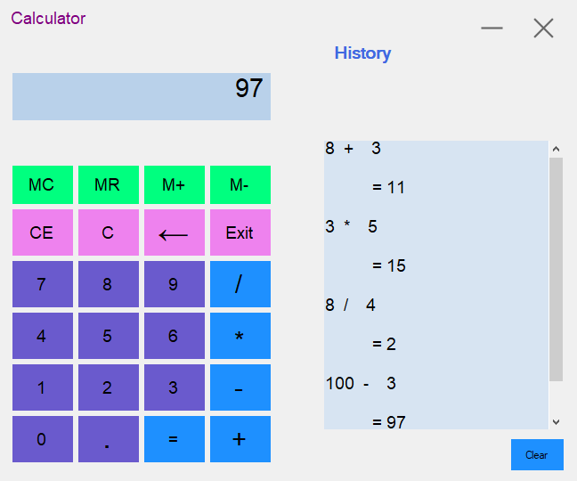

# MyCalculator

 
This Calculator is a simple calculator, with a panel that has more advanced functions when you need them. 
It includes history, memory features. In this calculator used Bunifu ui .
 
 

The goal is a simple and uncluttered calculator.

 
Because Calculator is a full replacement for your stock calculator.

C# used to make this calculator and it is an open source project. 

<h4>C# Calculator By Shuvo</h4>
